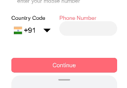

## Library Name - Phone Code

### Library Version - 1.0

### Library Release Date - 

### Library Overview
  Phone Code library provides access to a developer to add this into their own harmony os project, where user will get option to enter his/her nobile number. The main feature includes a list of phone codes of all the coutries from where usercan choose the coutry he/she belongs to and the Mobile code of that coutry will automatically added to the phonenumber field.

### How to use
1. Click on the ArrowDown button to open up the country list panel
2. Click on either the country name/flag/code.
3. The required data will automatically filled up in the desired box
4. Now enter your mobile number in the input field.
5. After all the entries click on the continue button for a successful submission. 

---

### Library UI overview 

 

---

## Library Feature 1: Button
  A beautiful coloured clickable button is provided underneath the input field, by clicking which user can submit his data into the server    


``` 
Button($r("app.string.continue"), { type: ButtonType.Normal, stateEffect: true })
          .borderRadius("8fp")
          .backgroundColor(0xff6874)
          .width("100%")

```



## Library Feature 2: Panel
 Upon clicking the dropdown button a panel will pop up from the buttom of the screen which displays the name, phone code and the cotry flag icon of the coutries. User can select his/her country and the phone code of that coutry will automatically adde up to the required field.

```    
      Panel(this.show) { // Show code list
        Column() {
          Row() {
            Text('Country Code')
              .fontSize("20fp")
              .height("40vp")
              .fontWeight("bold")
              .textAlign(TextAlign.Start)
              .margin({ bottom: "10vp" })
          }

          Divider().vertical(false).strokeWidth("2vp").color("Black").lineCap(LineCapStyle.Round)
          List({ space: "2vp", initialIndex: 0 }) {
            ForEach(this.arr, (item) => {
              ListItem() {
                Row() {


                  Flex() {
                    Image($rawfile('country_flag_' + item.co.trim() + '.png'))
                      .width("22vp")
                      .height("20vp")
                      .margin({ left: "5vp" })
                      .backgroundColor(0xFFFFFF)
                      .onClick(() => {
                        this.phone_code = item.ph
                        this.onPanelItemSelection(item.ph, item.co)
                      })
                  }
                  .width('10%')
                  .padding({left: 10})


                  Text(item.co)
                    .width('30%')
                    .height("50vp")
                    .padding({left: 30})
                    .fontSize("20fp")
                    .textAlign(TextAlign.Start)
                    .borderRadius("10vp")
                    .onClick(() => {
                      this.phone_code = item.ph
                      this.onPanelItemSelection(item.ph, item.co)
                    })


                  Text("+" + item.ph)
                    .width('60%')
                    .height("50vp")
                    .padding({right: 30})
                    .fontSize("20fp")
                    .textAlign(TextAlign.End)
                    .borderRadius("10vp")
                    .onClick(() => {
                      this.phone_code = item.ph
                      this.onPanelItemSelection(item.ph, item.co)
                    })


                }
              }.editable(true)
            })
          }.listDirection(Axis.Vertical)
        }
      }
      .type(PanelType.Foldable)
      .mode(PanelMode.Half)
      .dragBar(true)
      .halfHeight("1500vp")
      .onChange((value: any) => {
        console.info(`width:${value.width},height:${value.height},mode:${value.mode}`)
      })
    }

```


---

### Advance features that can be implemented into the library - 
* Voice search can be integrated so that user dont have to pick the coutry name everytime from the panel, instead he/she can do a voice search and the data will be filled up
* Application can seek permission to use the user's current location and the phonecode of that coutry in which the location exists can be filled up automatically.

### Open Source License
Licensed under [Apache-2.0 license](/LICENSE.txt)

### Coclusion
* It is a very useful Library which can save your lots of time by importing it directly into your App
* It is easy to use and very user friendly and it's UI is very much specific
* Specific fields acn be customized according to the need of the project